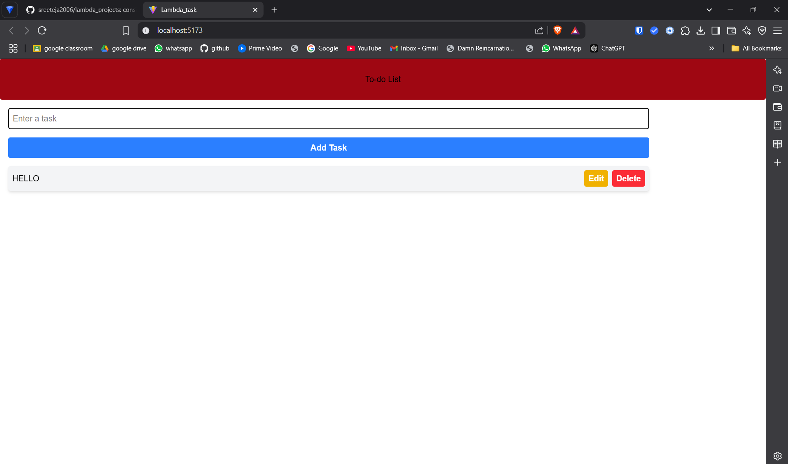

# To-Do List App

This is a simple and interactive To-Do List built using **React JS** and **Tailwind CSS**. It allows users to manage their daily tasks efficiently by providing the ability to add, edit, and delete tasks. The app has a clean and responsive UI styled with Tailwind.

## Features

- Add new tasks  
- Edit existing tasks  
- Delete tasks  
- Press "Enter" key to quickly add tasks  
- Styled using Tailwind CSS  
- Instant UI updates using React state  

## Tech Stack

- React JS – Frontend framework  
- Tailwind CSS – Utility-first CSS framework  
- JavaScript (ES6) – Language used for logic  

## Installation

To run this project locally:

1. Clone the repository  
   ```bash
   git clone https://github.com/sreeteja2006/lambda_projects.git
   ```

2. Navigate to the project directory  
   ```bash
   cd lambda_projects
   ```

3. Install the dependencies  
   ```bash
   npm install
   ```

4. Start the development server  
   ```bash
   npm run dev
   ```

Your app should now be running on `http://localhost:5173` (or similar, depending on Vite's port).

## Project Structure

```
lambda_projects/
├── public/
├── src/
│   ├── App.js         # Main application component
│   ├── App.css        # Custom CSS
│   └── main.jsx       # Entry point for React (if using Vite)
├── index.html         # Root HTML file
├── package.json       # Project metadata and dependencies
├── vite.config.js     # Vite configuration
└── README.md          # Project documentation
```

## Screenshot


```

```

## How It Works

- The app maintains a list of tasks using `useState`.  
- Each task is rendered with "Edit" and "Delete" buttons.  
- When editing a task, the input field is pre-filled and the "Add Task" button turns into "Update Task".  
- Everything updates in real-time as the state changes.

## Contributing

Feel free to fork this repository and submit pull requests. Bug fixes, improvements, and suggestions are always welcome.

## License

This project is licensed under the [MIT License](https://opensource.org/licenses/MIT).

---

Made by [sreeteja2006](https://github.com/sreeteja2006) using React and Tailwind CSS.
